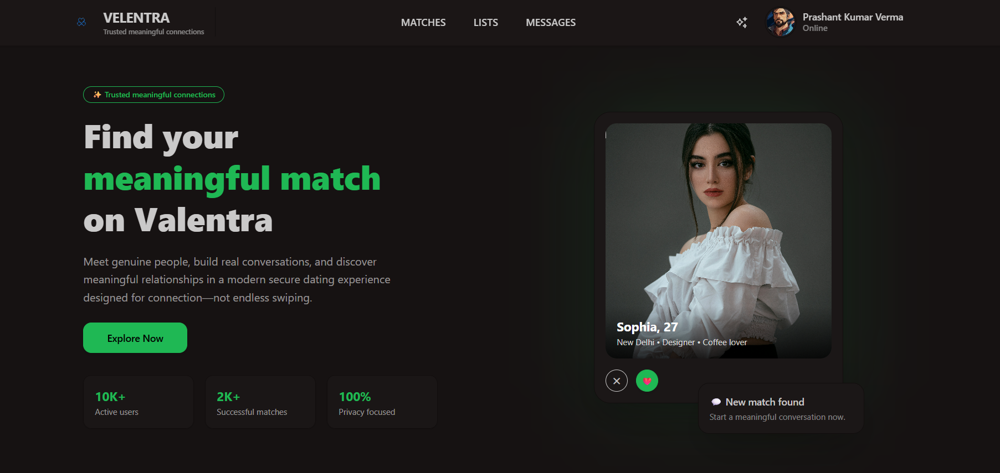
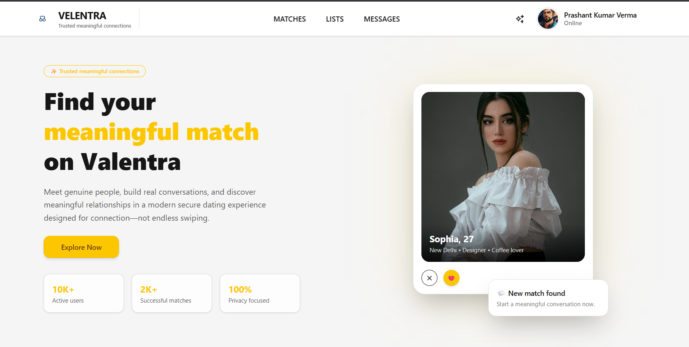
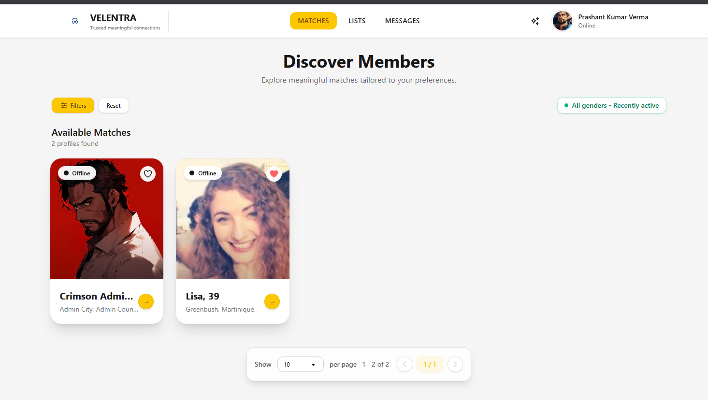
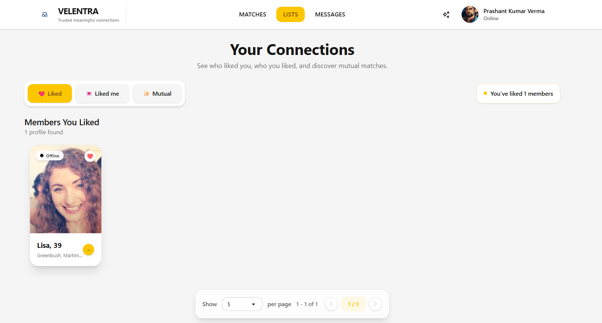
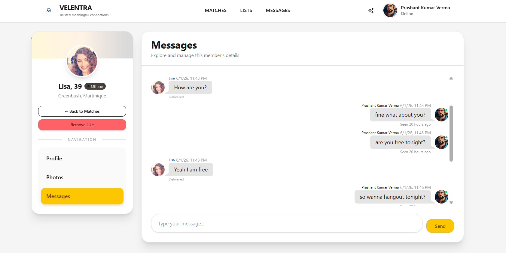
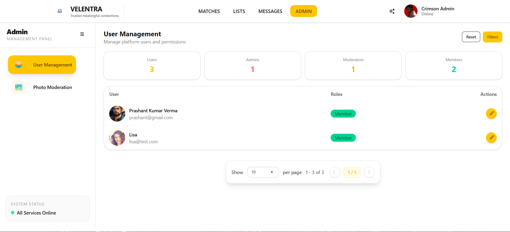
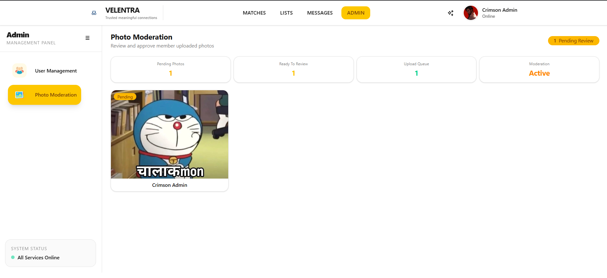
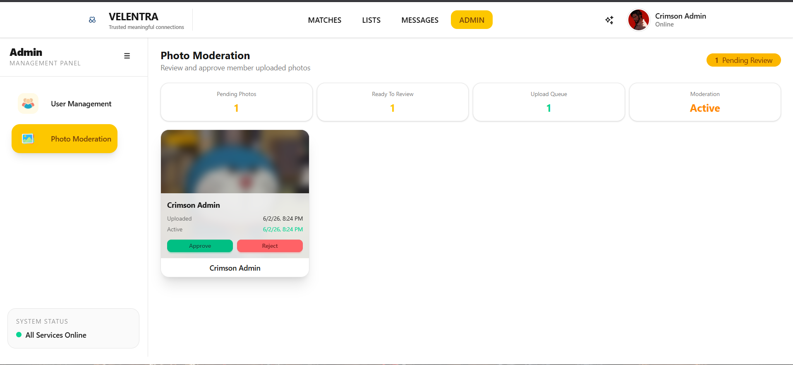

# 💝 Valentra - Modern Dating Platform

<p align="center">
  
</p>

<p align="center">
  <strong>Trusted Meaningful Connections</strong>
</p>

<p align="center">
  A modern full-stack dating application built with Angular 20, ASP.NET Core 9, SQL Server, SignalR, Cloudinary, and DaisyUI.
</p>

---

## 🚀 Overview

Valentra is a modern full-stack dating platform designed to help users build meaningful connections through real-time communication, intelligent profile discovery, likes, matching, and secure messaging.

The application combines a responsive Angular frontend with a scalable ASP.NET Core backend and includes powerful features such as:

- Real-time Messaging
- Online Presence Tracking
- Photo Moderation
- Role-Based Administration
- Secure Authentication
- Cloud-Based Image Storage

---

# 📷 Preview

## Home Page




---

## Member Discovery



---

## Messages



---

## User Management



---

## Photo Moderation




---
## ✨ Core Features

Valentra delivers a complete modern dating experience focused on meaningful connections, real-time communication, and secure user management. Users can create detailed profiles, upload photos, discover potential matches through advanced filtering, express interest through likes, and communicate instantly using a real-time messaging system powered by SignalR.

The platform includes live online presence tracking, message delivery and read status indicators, secure JWT-based authentication, role-based authorization, and a fully responsive experience optimized for mobile, tablet, laptop, and desktop devices.

Administrators and moderators are provided with dedicated management tools, including user role management and photo moderation workflows, helping maintain a safe and high-quality platform experience.

---

# 🏗️ Technology Stack

### Frontend

The frontend is built with **Angular 20**, **TypeScript**, **RxJS**, **Tailwind CSS 4**, and **DaisyUI 5**, providing a reactive architecture, modern design system, and responsive user experience.

### Backend

The backend is powered by **ASP.NET Core 9**, **Entity Framework Core 9**, **ASP.NET Identity**, **SignalR**, and **JWT Authentication**, delivering secure APIs, real-time communication, and scalable application architecture.

### Database

**Microsoft SQL Server** is used as the primary database for storing users, profiles, messages, likes, matches, photos, and administrative data.

### Hosting

Valentra is configured for deployment on **MonsterASP.NET** with SQL Server hosting support.

---

# 🔌 Third-Party Integrations

### Cloudinary

Cloudinary is responsible for image upload, storage, optimization, and global CDN delivery. It enables efficient profile photo management while ensuring fast image loading across all devices.

### SignalR

SignalR powers the application's real-time capabilities, including live messaging, online presence tracking, read receipts, message delivery updates, and instant notifications.

### ASP.NET Identity

ASP.NET Identity provides secure authentication, password hashing, user management, role management, and authorization policies throughout the platform.

---

# 📂 Architecture

Valentra follows a clean full-stack architecture with a clear separation between frontend and backend responsibilities.

```text
Angular Client
      │
      ▼
ASP.NET Core API
      │
      ▼
Entity Framework Core
      │
      ▼
SQL Server Database
```

Real-time communication is handled independently through dedicated SignalR hubs for messaging and presence tracking, ensuring fast and scalable user interactions.

---

# ⚡ Real-Time Experience

Valentra leverages SignalR to provide seamless real-time functionality. Users can instantly see who is online, receive messages without refreshing the page, view delivery and read statuses, and maintain live conversations with other members. Presence tracking supports multiple browser tabs and devices, ensuring accurate online status updates across the platform.

---

# 🔐 Security

Security is a core component of Valentra's architecture. The application uses JWT authentication, ASP.NET Identity password hashing, role-based authorization policies, protected API endpoints, SignalR token authentication, centralized exception handling, and server-side validation to ensure a secure and reliable experience for all users.

---

# 🚢 Deployment

Valentra is designed for deployment as a single integrated application. The Angular frontend is compiled directly into the ASP.NET Core `wwwroot` folder, allowing both frontend and backend to be hosted together under a single deployment.

The platform currently utilizes:

- MonsterASP.NET Hosting
- SQL Server Database Hosting
- Cloudinary Media Storage
- GitHub Source Control

This setup simplifies deployment while maintaining scalability and maintainability.

---

# 📈 Future Enhancements

## AI Features

- AI Match Recommendations
- AI Compatibility Scoring
- AI Conversation Starters
- AI Moderation

---

## Messaging

- Voice Messages
- Video Calling
- Typing Indicators
- Message Reactions
- File Sharing

---

## Administration

- Analytics Dashboard
- Moderation Reports
- User Activity Insights
- Automated Moderation

---


# 👨‍💻 Developer

## Prashant Kumar Verma

Full Stack Developer specializing in modern web applications built with Angular, ASP.NET Core, SQL Server, SignalR, and cloud-based technologies.

Valentra was developed as a complete end-to-end project demonstrating real-time communication, secure authentication, responsive UI/UX design, administrative workflows, media management, and scalable full-stack architecture.

### Core Expertise

- ASP.NET Core
- Angular
- TypeScript
- SQL Server
- SignalR
- Entity Framework Core
- REST APIs
- Cloud Integrations
- Authentication & Authorization

---

<p align="center">
Built with ❤️ using Angular 20, ASP.NET Core 9, SignalR, SQL Server, Cloudinary, Tailwind CSS, and DaisyUI.
</p>